# Agents Commander — Architecture Map

> Auto-generated from codebase analysis. Version 0.4.6, branch `feature/agents-communication`.

---

## 1. High-Level Architecture

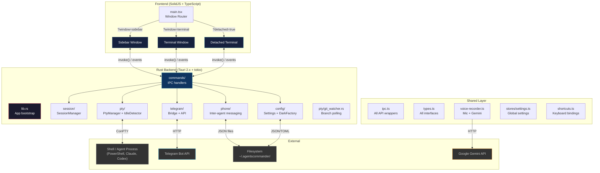

---

## 2. Rust Backend Modules

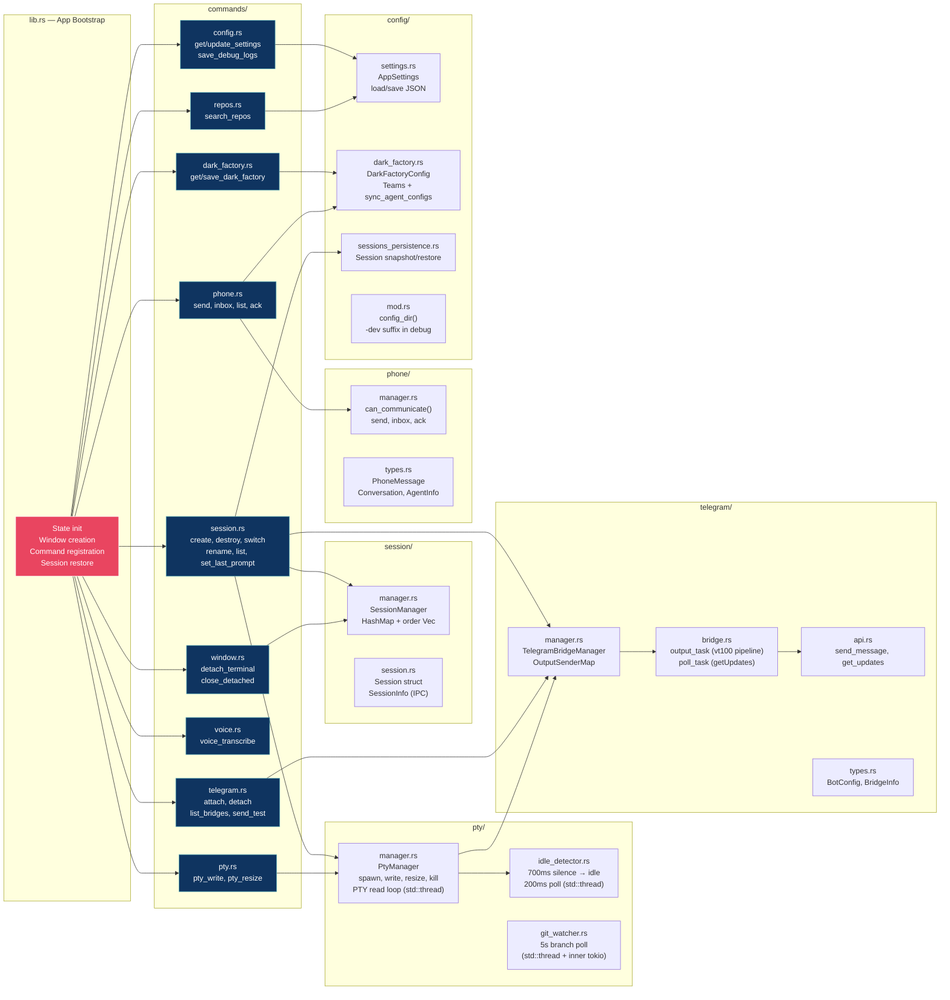

---

## 3. Frontend Components

### 3.1 Sidebar Window

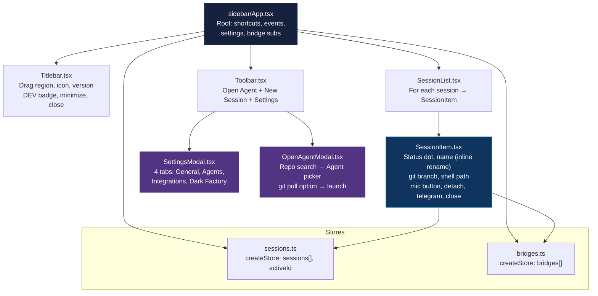

### 3.2 Terminal Window

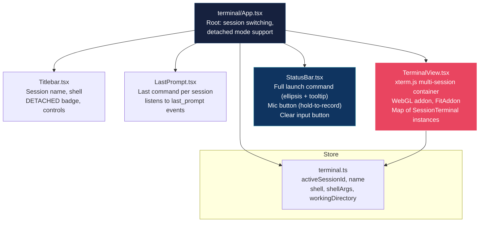

### 3.3 Shared Layer

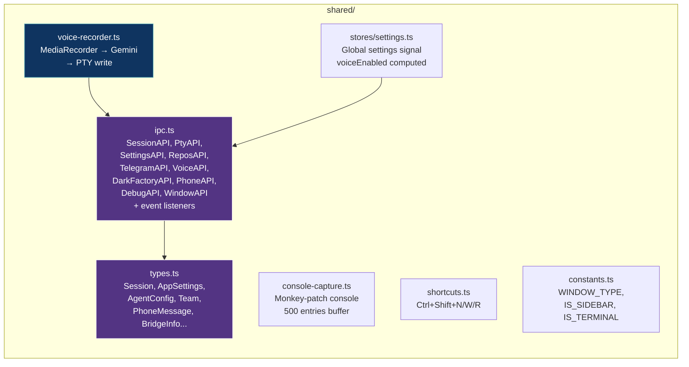

---

## 4. IPC Contract — All Commands

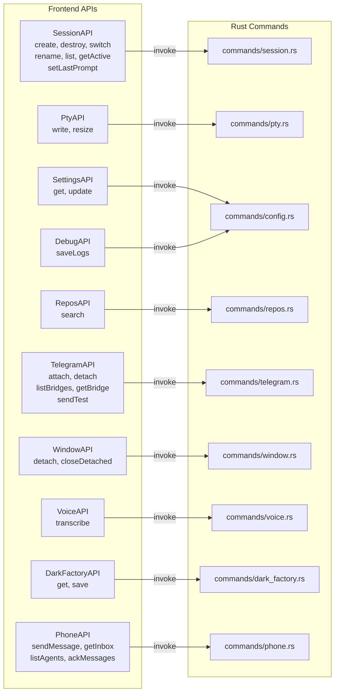

---

## 5. Events — Backend to Frontend

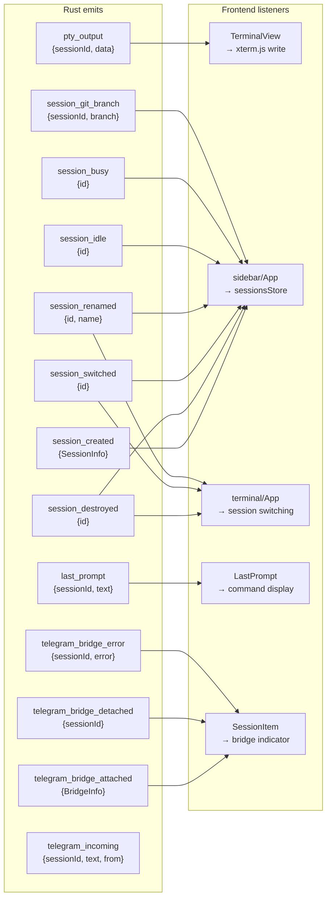

---

## 6. Data Flows

### 6.1 Session Lifecycle

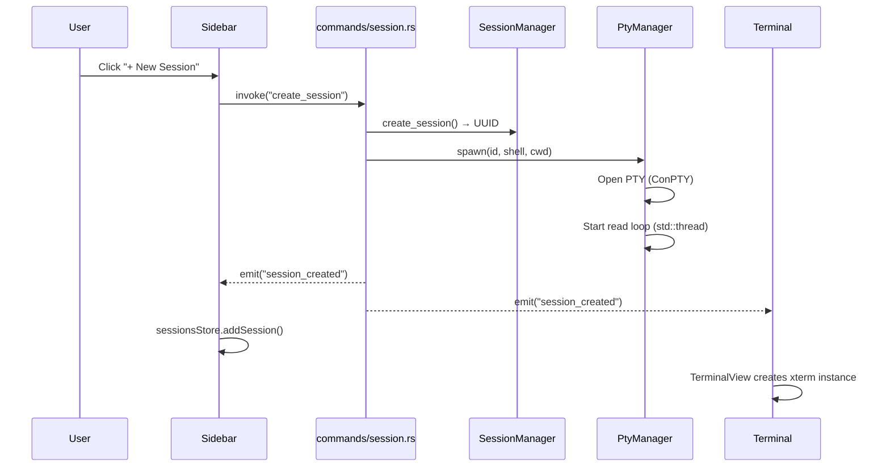

### 6.2 Terminal I/O

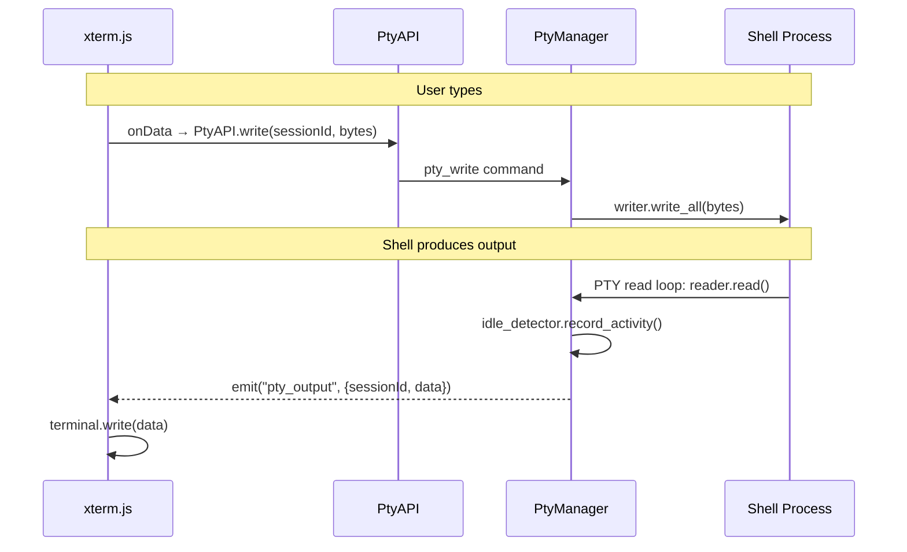

### 6.3 Telegram Bridge Pipeline

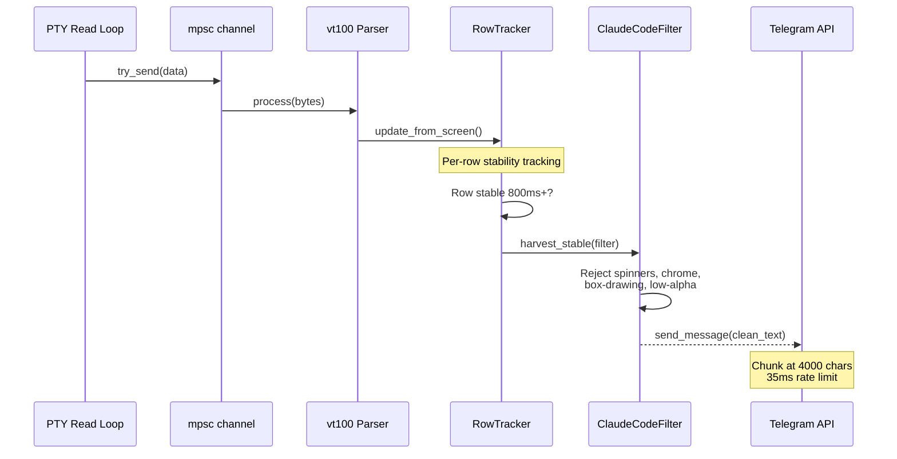

### 6.4 Voice-to-Text

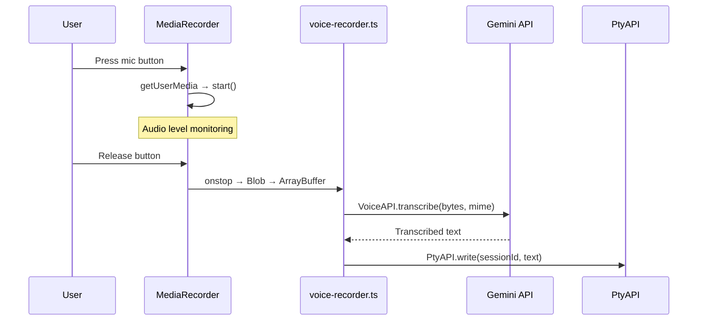

---

## 7. State Management

### 7.1 Rust Managed State

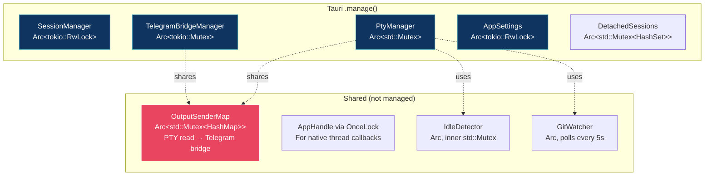

### 7.2 Frontend State

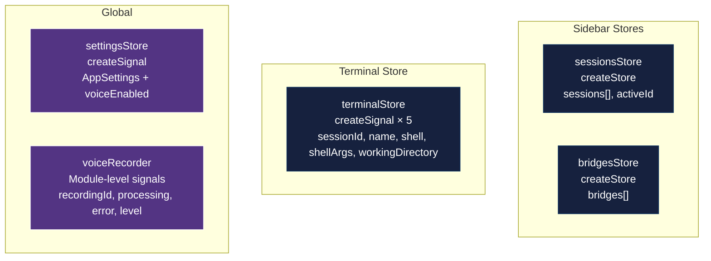

---

## 8. Persistence — Files on Disk

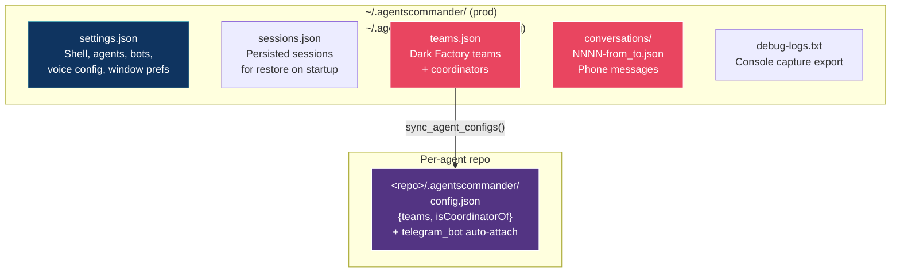

---

## 9. Threading Model

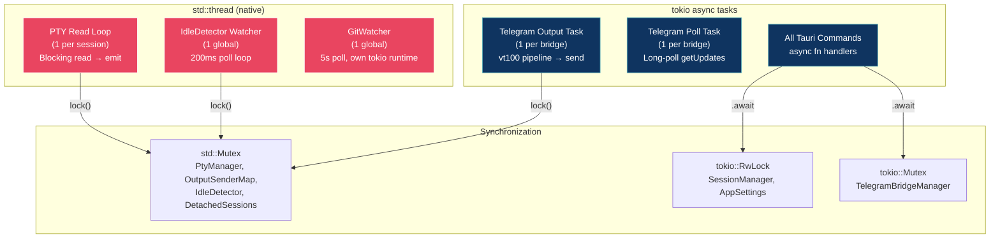

---

## 10. File Index

### Rust Backend (`src-tauri/src/`)

| File | Purpose |
|------|---------|
| `main.rs` | Thin shim → `lib::run()` |
| `lib.rs` | App bootstrap, state init, window creation, session restore, command registration |
| `errors.rs` | `AppError` enum (thiserror) |
| `session/session.rs` | `Session`, `SessionInfo`, `SessionStatus` structs |
| `session/manager.rs` | `SessionManager` — CRUD, ordering, active tracking |
| `pty/manager.rs` | `PtyManager` — spawn, read loop, write, resize, kill |
| `pty/idle_detector.rs` | 700ms silence detection, idle/busy events |
| `pty/git_watcher.rs` | 5s branch polling via `git rev-parse` |
| `telegram/types.rs` | `TelegramBotConfig`, `BridgeInfo`, `BridgeStatus` |
| `telegram/api.rs` | `send_message()`, `get_updates()` |
| `telegram/manager.rs` | `TelegramBridgeManager`, `OutputSenderMap` |
| `telegram/bridge.rs` | vt100 pipeline, `RowTracker`, `ClaudeCodeFilter`, output/poll tasks |
| `phone/types.rs` | `PhoneMessage`, `Conversation`, `AgentInfo` |
| `phone/manager.rs` | `can_communicate()`, `send_message()`, `get_inbox()`, `ack_messages()` |
| `config/mod.rs` | `config_dir()` — `-dev` suffix in debug |
| `config/settings.rs` | `AppSettings`, `AgentConfig`, load/save JSON |
| `config/dark_factory.rs` | `DarkFactoryConfig`, `Team`, `TeamMember`, `sync_agent_configs()` |
| `config/sessions_persistence.rs` | `PersistedSession`, snapshot/restore |
| `commands/session.rs` | create, destroy, switch, rename, list, set_last_prompt |
| `commands/pty.rs` | pty_write, pty_resize |
| `commands/config.rs` | get/update_settings, save_debug_logs |
| `commands/telegram.rs` | attach, detach, list_bridges, get_bridge, send_test |
| `commands/window.rs` | detach_terminal, close_detached_terminal |
| `commands/repos.rs` | search_repos (agent detection) |
| `commands/voice.rs` | voice_transcribe (Gemini API) |
| `commands/dark_factory.rs` | get/save_dark_factory |
| `commands/phone.rs` | send, inbox, list, ack |

### Frontend (`src/`)

| File | Purpose |
|------|---------|
| `main.tsx` | Entry, window routing by query param |
| `shared/types.ts` | All TypeScript interfaces |
| `shared/ipc.ts` | All API wrappers + event listeners |
| `shared/shortcuts.ts` | Global keyboard shortcuts (Ctrl+Shift+N/W/R) |
| `shared/constants.ts` | `WINDOW_TYPE`, `IS_SIDEBAR`, `IS_TERMINAL` |
| `shared/voice-recorder.ts` | Mic recording → Gemini → PTY inject |
| `shared/console-capture.ts` | Console monkey-patch, 500 entries buffer |
| `shared/stores/settings.ts` | Global `AppSettings` signal + `voiceEnabled` |
| `sidebar/App.tsx` | Sidebar root — events, shortcuts, bridge subs |
| `sidebar/stores/sessions.ts` | `sessions[]` + `activeId` reactive store |
| `sidebar/stores/bridges.ts` | `bridges[]` reactive store |
| `sidebar/components/Titlebar.tsx` | Drag region, icon, version, controls |
| `sidebar/components/SessionList.tsx` | `<For>` over sessions → `SessionItem` |
| `sidebar/components/SessionItem.tsx` | Status dot, name, git branch, mic, telegram, detach, close |
| `sidebar/components/Toolbar.tsx` | Open Agent + New Session + Settings gear |
| `sidebar/components/SettingsModal.tsx` | 4-tab settings: General, Agents, Integrations, Dark Factory |
| `sidebar/components/OpenAgentModal.tsx` | Repo search → agent picker → launch |
| `terminal/App.tsx` | Terminal root — session switching, detached mode |
| `terminal/stores/terminal.ts` | `activeSessionId`, `name`, `shell`, `shellArgs`, `workingDirectory` signals |
| `terminal/components/TerminalView.tsx` | xterm.js multi-session container, WebGL, FitAddon |
| `terminal/components/Titlebar.tsx` | Session name, shell, DETACHED badge |
| `terminal/components/StatusBar.tsx` | Full launch command (ellipsis + tooltip), mic button, clear input |
| `terminal/components/LastPrompt.tsx` | Last command display per session |

### Config Files

| File | Purpose |
|------|---------|
| `src-tauri/tauri.conf.json` | Tauri config, app version, window defs, capabilities |
| `src-tauri/Cargo.toml` | Rust dependencies (v0.4.6) |
| `package.json` | Frontend deps, scripts (`tauri dev`, `kill-dev`) |
| `vite.config.ts` | Vite config, `__APP_VERSION__` injection from tauri.conf.json |
